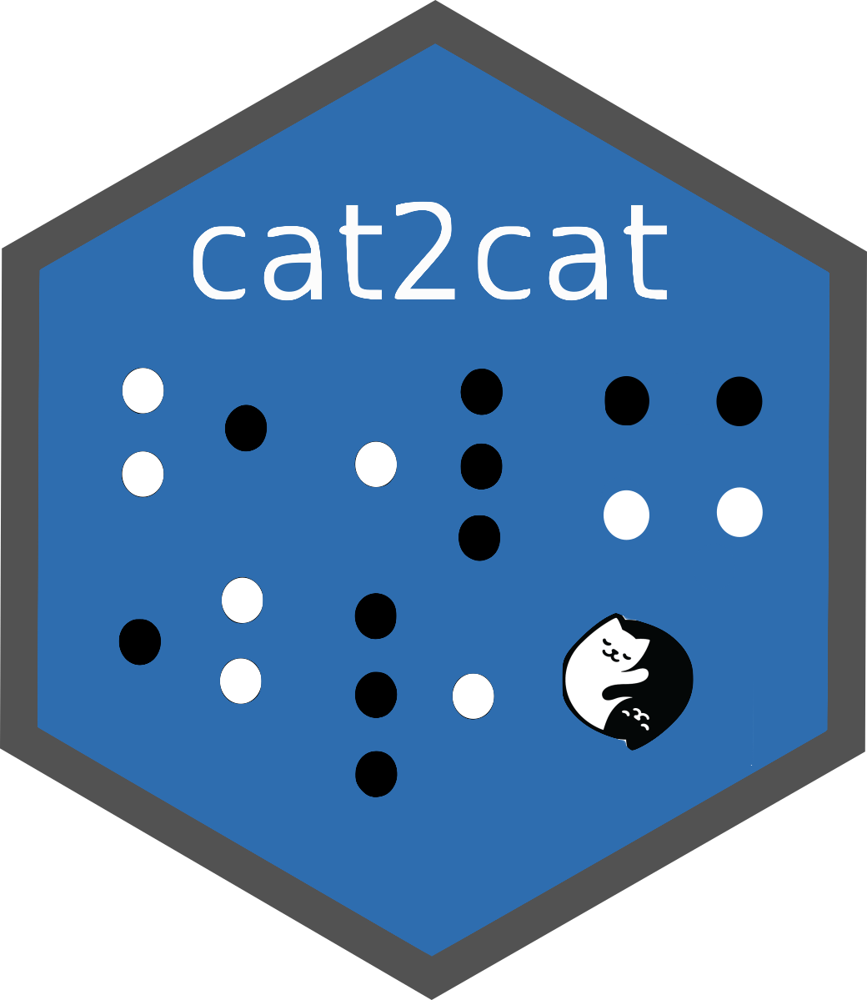
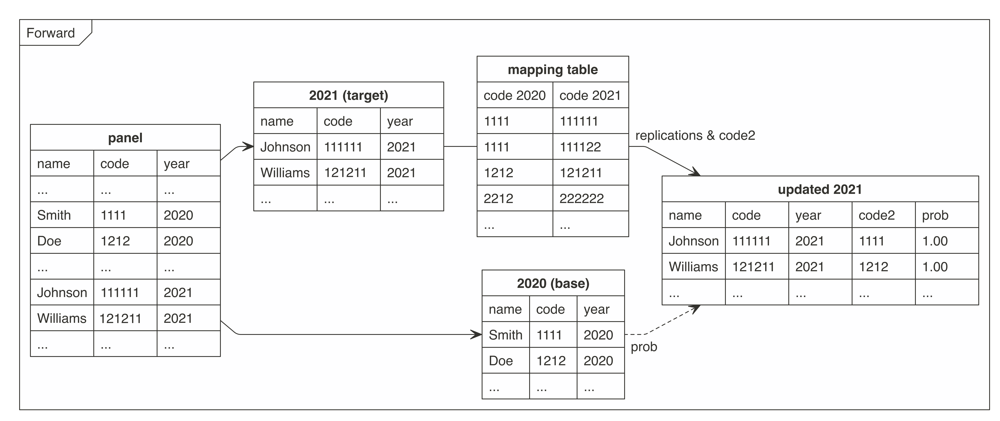
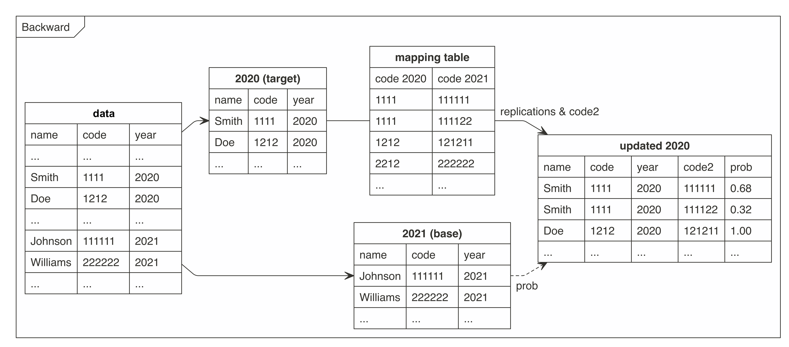

# cat2cat <a href='https://github.com/polkas/cat2cat'></a>

[](https://github.com/polkas/cat2cat/actions)
[](https://cran.r-project.org/package=cat2cat)
[](https://app.codecov.io/gh/Polkas/cat2cat)
[](https://cran.r-project.org/package=cat2cat)

## Handling an Inconsistent Coded Categorical Variable in a Longitudinal Dataset

**cat2cat** provides a statistical solution for harmonising categorical variables whose encoding changes between survey waves or data releases.
If you work with longitudinal data where classification schemes evolve - occupations (ISCO), diseases (ICD), industries (NACE), products, or fields of education - this package helps you produce valid cross-temporal analyses.

### The Problem

Real-world classifications change.
When ISCO-88 becomes ISCO-08, or ICD-9 becomes ICD-10, a single old code may map to multiple new codes (and vice versa).
Naive responses are unsatisfactory: running separate analyses by period blocks direct comparison, manual recoding is arbitrary and hard to reproduce, and ignoring the change altogether can bias results.

### The Solution

**cat2cat** maps a categorical variable using a transition table between two time points.
The transition table should list the candidate categories for each code in the period being harmonised.
When one observed code can correspond to several target categories, **cat2cat** replicates the observation across those candidates and then assigns probability weights using either simple frequencies or ML-based predictions.

**cat2cat** implements a **replication-and-weighting** algorithm that:

1. Replicates each observation onto all candidate categories from the mapping table for a specific direction (forward or backward)
2. Assigns probability weights (summing to 1 per subject) based on category frequencies, naive or ML predictions
3. Preserves mean and the central moments of non-mapped variables, so coefficients remain unbiased

The result is a unified categorical variable across periods, ready for longitudinal analysis, subgroup comparisons, and trend studies.

NOTE: For a complete panel where every subject is observed in both periods and the target-period category is known, probabilistic harmonisation may not be needed: the target category can often be joined back by the subject identifier. `cat2cat()` is most useful when classifications change and some observations cannot be directly linked to a target-period category, such as in repeated cross-sections, rotational panels, or panels with entrants and leavers.

### Value Added of cat2cat

cat2cat separates true structural change from coding-system change. This is the
main value for longitudinal analysis.

After harmonisation, you can:

- Track trends within specific groups (for example occupations, industries, diagnoses) across waves
- Compare subgroup dynamics on one consistent coding scheme
- Estimate models with group-level effects or interactions
- Run sensitivity checks across weighting assumptions and report uncertainty transparently

### Direction

With cat2cat, you can harmonize in both directions:

#### Forward Mapping (Old → New)



#### Backward Mapping (New → Old)



For evolutionary classifications (new one is more detailed), forward mapping often produces fewer replications.
For hierarchical classifications, where each additional digit adds detail, truncating the mapping table to fewer digits often reduces replication under backward mapping. Under forward mapping, however, truncation can also increase replication by collapsing categories into broader prefixes.

### Key Features

| Feature | Benefit |
| ------- | ------- |
| **Mean and variance preserving weights** | Regression coefficients for non-mapped variables remain unbiased when not interacted with the harmonised variable |
| **Multiple weight methods** | Naive, frequency-based, kNN, random forest, LDA, naive Bayes, and ensemble weights |
| **Multi-period chaining** | Handle 3, 4, or more waves with iterative mapping |
| **SE correction** | `summary_c2c()` adjusts standard errors for replicated data |
| **Fixed effects ready** | Unified `g_new_c2c` variable enables occupation/industry FE across time |
| **Aggregated data support** | `cat2cat_agg()` handles pre-aggregated counts with equation syntax |
| **Validation** | `cat2cat_ml_run()` validates ML and baseline weights |
| **Minimal dependencies** | Base R only in Imports; ML methods are in Suggests |

### References

- **Method**: [Nasinski, Majchrowska & Broniatowska (2020)](https://doi.org/10.24425/cejeme.2020.134747) — *Central European Journal of Economic Modelling and Econometrics*
- **Software**: [Nasinski & Gajowniczek (2023)](https://doi.org/10.1016/j.softx.2023.101525) — *SoftwareX*

### Ecosystem

| | |
| --- | --- |
| [**R Package**](https://cran.r-project.org/package=cat2cat) | CRAN, production-ready |
| [**Python Package**](https://pypi.org/project/cat2cat/) | PyPI, equivalent functionality |
| [**Documentation**](https://polkas.github.io/cat2cat/) | Full API reference and vignettes |

## Documentation

For guidance on when cat2cat is appropriate (and when it isn't), see the [When cat2cat won't help](https://polkas.github.io/cat2cat/articles/cat2cat.html#when-cat2cat-wont-help) section in the Get Started vignette.

- [Get Started](https://polkas.github.io/cat2cat/articles/cat2cat.html) - Core concepts, assumptions, and a step-by-step two-period workflow with `cat2cat()`
- [Choosing Weights and Validating ML](https://polkas.github.io/cat2cat/articles/cat2cat_validation.html) — comparing weight methods, pruning strategies, ensembles, ML validation with `cat2cat_ml_run()`
- [Advanced Workflows](https://polkas.github.io/cat2cat/articles/cat2cat_advanced.html#ml-weights) — ML weights, multi-period chaining, panel identifiers, aggregated data, and regression workflows

## Installation

```r
# Stable release from CRAN
install.packages("cat2cat")

# Development version from GitHub
# install.packages("remotes")
remotes::install_github("polkas/cat2cat")
```

## Citation

If you use cat2cat in your research, please cite:

```text
Nasinski M, Gajowniczek K (2023). "cat2cat: Handling an Inconsistently Coded 
Categorical Variable in a Longitudinal Dataset." SoftwareX, 24, 101525. 
doi:10.1016/j.softx.2023.101525
```

```bibtex
@article{nasinski2023cat2cat,
  title={cat2cat: Handling an Inconsistently Coded Categorical Variable in a Longitudinal Dataset},
  author={Nasinski, Maciej and Gajowniczek, Krzysztof},
  journal={SoftwareX},
  volume={24},
  pages={101525},
  year={2023},
  doi={10.1016/j.softx.2023.101525}
}
```
