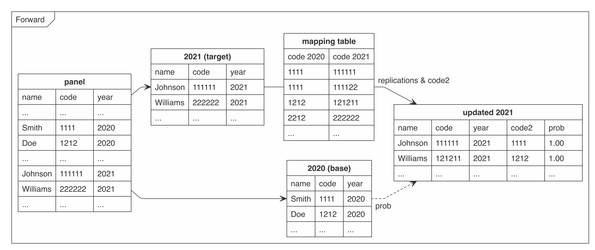

# cat2cat <a href='https://github.com/polkas/cat2cat'></a>
[](https://github.com/polkas/cat2cat/actions)
[](https://cran.r-project.org/package=cat2cat)
[](https://codecov.io/gh/Polkas/cat2cat)
[](https://cran.r-project.org/package=cat2cat)

## Handling an Inconsistent Coded Categorical Variable in a Panel Dataset

Unifying an inconsistent coded categorical variable in a panel/longtitudal dataset.  
There is offered the `cat2cat` procedure to map a categorical variable according to a mapping (transition) table between two different time points.
The mapping (transition) table should to have a candidate for each category from the targeted for an update period. The main rule is to replicate the observation if it could be assigned to a few categories, then using simple frequencies or statistical methods to approximate probabilities of being assigned to each of them.

**This algorithm was invented and implemented in the paper by (Nasinski, Majchrowska and Broniatowska (2020) <doi:10.24425/cejeme.2020.134747>).**

[**Please visit the cat2cat webpage for more information**](https://polkas.github.io/cat2cat/articles/cat2cat.html)

[**Python Version**](https://pypi.org/project/cat2cat/)

## Installation

```r
# install.packages("remotes")
remotes::install_github("polkas/cat2cat")
# or
install.packages("cat2cat")
```

## Example

`occup` dataset is an example of unbalance panel dataset.
This is a simulated data although there are applied a real world characteristics from national statistical office survey.
The original survey is anonymous and take place **every two years**.

`trans` dataset containing mappings (transitions) between old (2008) and new (2010) occupational codes.
This table could be used to map encodings in both directions.

Panel dataset without the unique identifiers and only two periods, backward and simple frequencies:

```{r}
library("cat2cat")
data("occup", package = "cat2cat")
data("trans", package = "cat2cat")

occup_old <- occup[occup$year == 2008, ]
occup_new <- occup[occup$year == 2010, ]

occup_simple <- cat2cat(
  data = list(old = occup_old, new = occup_new, cat_var = "code", time_var = "year"),
  mappings = list(trans = trans, direction = "backward")
)
```

Panel dataset without the unique identifiers and four periods, backward and simple frequencies:

```{r}
library("cat2cat")
data("occup", package = "cat2cat")
data("trans", package = "cat2cat")

occup_2006 <- occup[occup$year == 2006,]
occup_2008 <- occup[occup$year == 2008,]
occup_2010 <- occup[occup$year == 2010,]
occup_2012 <- occup[occup$year == 2012,]

# 2010 -> 2008
occup_back_2008_2010 <- cat2cat(
  data = list(old = occup_2008, new = occup_2010, cat_var = "code", time_var = "year"),
  mappings = list(trans = trans, direction = "backward")
)

# 2008 -> 2006
occup_back_2006_2008 <- cat2cat(
  data = list(old = occup_2006,
              new = occup_back_2008_2010$old,
              cat_var_new = "g_new_c2c",
              cat_var_old = "code",
              time_var = "year"),
  mappings = list(trans = trans, direction = "backward")
)

occup_2006_new <- occup_back_2006_2008$old
occup_2008_new <- occup_back_2008_2010$old # or occup_back_2006_2008$new
occup_2010_new <- occup_back_2008_2010$new
occup_2012_new <- dummy_c2c(occup_2012, cat_var = "code")

final_data_back <- do.call(rbind, list(occup_2006_new, occup_2008_new, occup_2010_new, occup_2012_new))

# possible processing, leaving only one obs per subject and period
# still it is recommended to leave all replications and use the weights in the statistical models
library(magrittr)
ff <- final_data_back %>% 
  split(.$year) %>% 
  lapply(function(x) prune_c2c(x, method = "highest1")) %>% 
  do.call(rbind, .)
all.equal(nrow(ff), sum(final_data_back$wei_freq_c2c))
```

**More complex examples are presented in the "Get Started" vignette.**

## Graph

The graphs present how the `cat2cat::cat2cat` function works, in this case under a panel dataset without the unique identifiers and only two periods.





